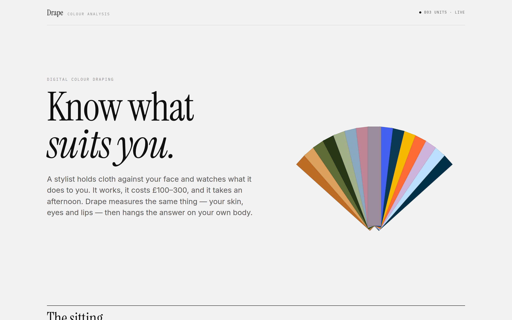
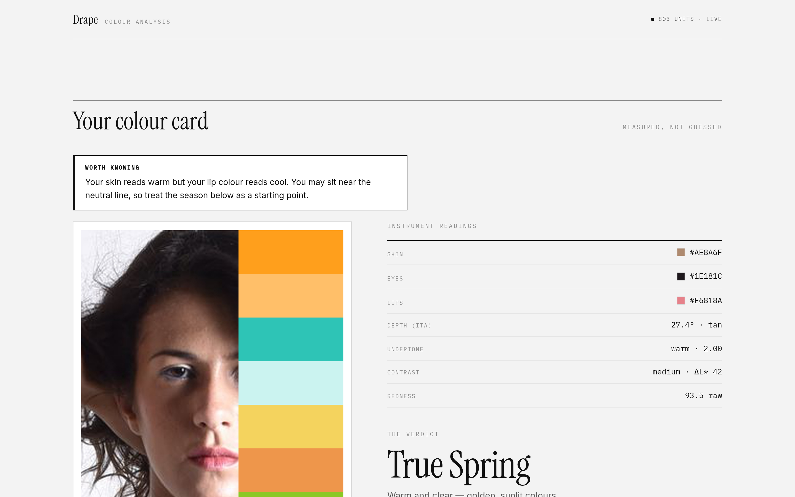
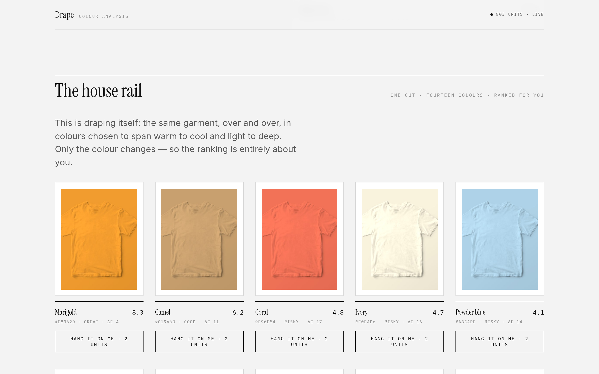
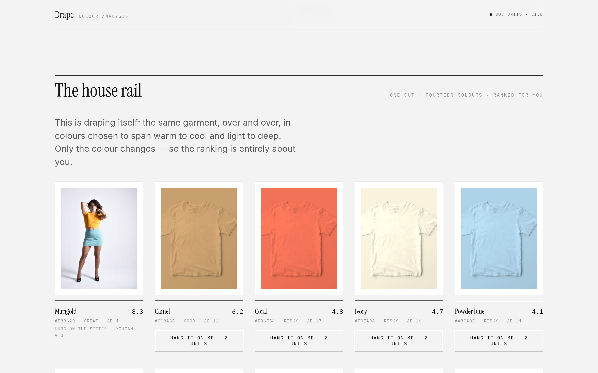
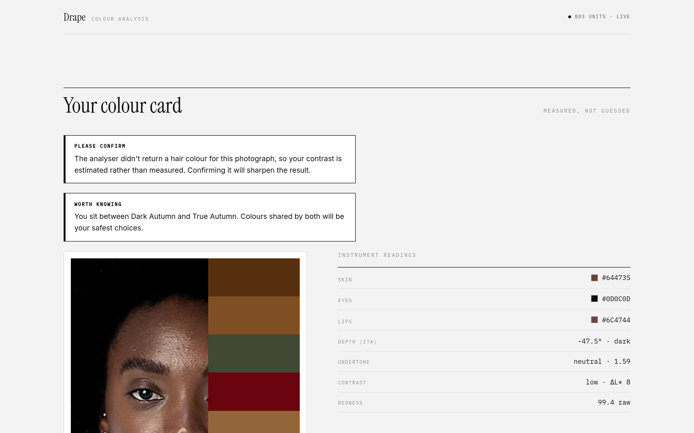
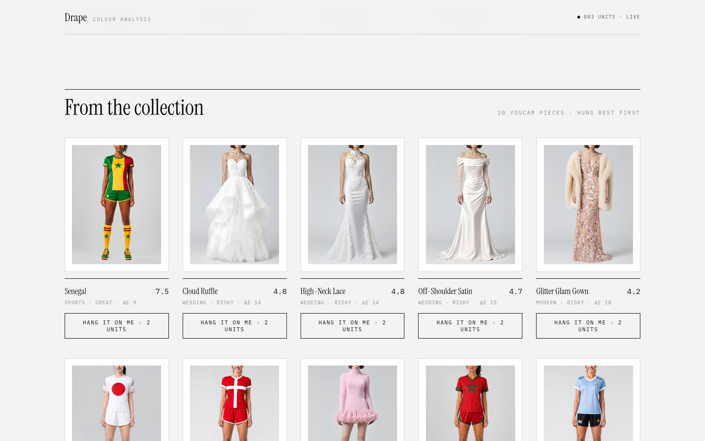
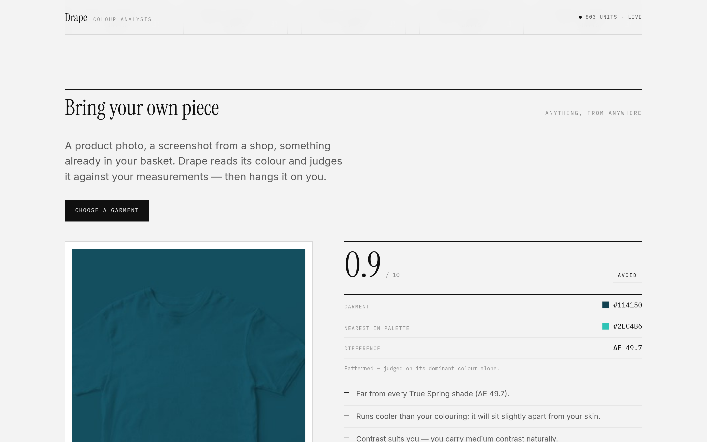

# Drape

**Digital colour draping.** Measure someone's skin, eyes and lips, work out which colours
actually suit them, then hang real garments on their body to prove it.

Built for the YouCam API Skin AI & Apparel VTO Hackathon, in the **Skin AI + Apparel VTO**
combined track.

**Live:** https://drape-five-delta.vercel.app — no sign-in, and the three completed
sittings need no API units, so you can explore the whole product immediately.

---

## Screenshots

| | |
| --- | --- |
|  |  |
| **The sitting.** The interface is deliberately achromatic — the only colour on screen is the user's own measured palette. | **Your colour card.** Measured skin, eye and lip hex; ITA depth; undertone; contrast. Monospace means instrument-read. |
|  |  |
| **The house rail.** One garment, fourteen colours, ranked. Only the colour changes, so the ranking is entirely about the person. | **Hung on the sitter.** The top-ranked colour rendered on her actual body by YouCam Apparel VTO. |
|  |  |
| **A second sitter** measures Dark Autumn — and the same rail reorders completely. | **From the collection.** All twenty YouCam catalogue pieces ranked against the palette. |
|  | |
| **Bring your own piece.** Upload any garment; its colour is read in the browser and judged against your measurements, with reasons. | |

---

## The problem

People cannot tell which colours suit them. The professional answer is *colour draping*: a
stylist holds fabric swatches against your face and judges which ones make you look healthy and
which make you look tired. It works, and it sells for £100–300 a session — demand is large and
growing across Korea, China and India.

It does not scale. It needs a trained human, good daylight, and physical fabric. Online shoppers
get none of that, so they guess, and colour is a leading reason clothes come back.

## What Drape does

1. **Measures.** YouCam's Facial Colour Tones Analyzer returns skin, eye, lip and eyebrow colour
   as hex values. YouCam's AI Skin Analysis returns fourteen concern scores including redness.
2. **Reasons.** Drape's own colour engine converts those measurements into a personal palette:
   ITA° for depth, the b\*/a\* ratio for undertone, hair-to-skin lightness spread for contrast.
   A twelve-season classification places the person in a three-axis space and names a season plus
   a runner-up.
3. **Judges.** Any garment — a product photo, a screenshot, something in a basket — is reduced to
   its dominant colour and scored against that palette with ΔE2000, plus contrast fit and a
   redness penalty. The score comes with reasons, not just a number.
4. **Proves it.** YouCam's AI Clothes Virtual Try-On hangs the garment on the person's own body.

### The house rail

The clearest demonstration is the **house rail**: one garment, fourteen colours spanning warm to
cool and light to deep. Nothing changes but the colour, so the ranking is entirely about the
person. For the sitter in the demo — measured as True Spring — it ranks Marigold 8.3 and Camel 6.2
at the top, and Charcoal, Slate and Petrol at the bottom. That is textbook warm-clear colour
theory, arrived at purely from measurement, and any one of them can be rendered on her in about
15 seconds. A second sitter measures Dark Autumn, and the same fourteen garments reorder
completely — Rust and Moss rise to the top and Marigold falls away.

**The link between the two APIs, in one sentence:** your measured undertone and redness decide
which garment colours we surface, and Apparel VTO shows the result on your own body before you buy.

## Why this isn't a wrapper

The APIs measure skin and render try-ons. Neither tells you which colours suit someone. That
mapping is ours, it runs in `lib/colour.ts` and `lib/palette.ts`, it costs zero API units, and it
is what turns two measurements into a recommendation.

Drape also **cross-validates the API against itself**. Our independently computed skin L\*a\*b\* is
checked against the API's `skin_color`, and the reported hair colour is sanity-checked. That
matters: during development the tone analyser returned `#FAF0BE "Blonde"` for a subject with
abundant dark brown hair. Rather than silently mis-seasoning the user, Drape detects the
implausible reading and asks for confirmation — which is what a human colour analyst does too.

---

## What we measured, rather than assumed

Everything below was measured against the live API and cross-checked against the official docs.
The full record is in [`docs/superpowers/specs/2026-08-16-drape-design.md`](docs/superpowers/specs/2026-08-16-drape-design.md).

| Fact | Value |
| --- | --- |
| AI Skin Analysis, 14 concerns | 16 units, 10–12 s |
| Facial Colour Tones Analyzer | 20 units, ~9 s |
| AI Clothes VTO (`task/cloth`) | 2 units, 13–17 s |
| Failed tasks | 0 units (docs confirm; measured repeatedly) |
| VTO determinism | identical inputs → identical output, so caching is safe |

Three findings that changed the build:

- **`ui_score` is not a measurement.** Perfect Corp's docs state it is adjusted upward "to produce
  more favorable results". Drape displays **`raw_score`** everywhere.
- **Skin Analysis needs the face to fill >60% of the image width.** It is a *fraction*, not a pixel
  count — a sharp 1000px face inside a wide frame still fails. Upscaling does not rescue it.
- **`task/cloth` (v2) beats `cloth-v4` for colour fidelity.** Measured hue shift against a known
  reference garment: −4 to −5° on v2 versus −11.8° on v4. Hue is the axis that decides warm vs
  cool, so Drape uses v2.

### A claim we deliberately do not make

We tested whether garment colour measurably improves skin scores, using the same shirt in warm
orange and cool teal, with a repeat run to establish noise:

| Comparison | Total movement across 14 concerns |
| --- | --- |
| Same garment twice (noise) | 0 |
| Warm vs cool garment | 4.0; overall score +0.2 |

The effect is negligible. The larger movement seen against the original photograph is **generative
face smoothing, not colour physics** — proven because warm and cool barely differ from each other
while both differ from the original. So Drape never claims a try-on improves your measured skin.
It shows the reasoning and the picture.

---

## YouCam APIs used

| API | Endpoint | Role |
| --- | --- | --- |
| Facial Colour Tones Analyzer | `POST /s2s/v2.0/task/skin-tone-analysis` | skin / eye / lip / hair hex — drives the palette |
| AI Skin Analysis | `POST /s2s/v2.0/task/skin-analysis` | 14 raw concern scores; redness feeds garment scoring |
| AI Clothes Virtual Try-On | `POST /s2s/v2.0/task/cloth` | hangs garments on the subject |
| Garment catalogue | `GET /s2s/v2.0/task/template/cloth` | the gallery, ranked by palette |
| File upload | `POST /s2s/v2.0/file/{feature}` | presigned upload for every image |
| Units | `GET /s2s/v1.0/client/credit` | live budget guard |

Authentication is the V1 server-to-server flow: an RSA PKCS#1 v1.5 `id_token` built from the API
key and a timestamp, exchanged at `POST /s2s/v1.0/client/auth` for a bearer token
(`lib/youcam.ts`). Credentials stay server-side and never reach the browser.

---

## Running it

Requires Node 20+.

```bash
git clone https://github.com/aswin-giridhar/drape.git
cd drape
npm install
cp .env.example .env      # then fill in your two YouCam values
npm run dev               # http://localhost:3000
```

These steps were run verbatim from a fresh clone on a clean machine —
`npm install` (95 packages, 30s) and `npm run build` both complete green without
credentials. Credentials are only needed at request time, not at build time.

`.env` needs:

```
YouCam_API_KEY=sk-...
YouCam_SecretKey=MIGf...   # base64 DER RSA public key from the YouCam console
```

> If you save `.env` on Windows, watch for CRLF line endings — a trailing `\r` on the key produces
> an opaque auth failure. `lib/youcam.ts` trims values defensively for exactly this reason.

### Tests

```bash
npx vitest run lib/palette.test.ts      # colour engine — no API calls, no units
npx vitest run lib/youcam.smoke.test.ts # live auth + catalogue — 0 units
npx vitest run scripts/genpreset.test.ts# rebuilds the pre-scanned demo profile
```

The palette test is a real gate, not a formality: it scores **held-out** colours that appear in no
palette, and asserts the flattering set beats the clashing set. It also checks the ranking is
stable when the redness threshold is perturbed, because a threshold that only separates at one
point is a coin toss.

### Testing without spending units

Open **Sitting no. 1** on the live site. It is a completed analysis stored in
`public/presets/person_b.json` from real API responses, so the full colour card, palette and skin
reading render instantly at zero cost. Try-ons and your own photographs use the live API.

---

## Architecture

```
app/
  page.tsx              gallery UI — sitting, colour card, gallery, your own piece
  api/scan              tone + skin analysis -> colour profile
  api/tryon             apparel VTO, with a deterministic-safe cache
  api/catalogue         garment templates (free)
  api/budget            live unit balance for the honest "paused" banner
lib/
  colour.ts             CIEDE2000, ITA, undertone, contrast — pure maths
  palette.ts            12-season classification + garment scoring
  garment.ts            dominant-colour extraction, in the browser via canvas
  youcam.ts             YouCam S2S client
  profile.ts            assembly + cross-validation + warnings
  skinzip.ts            unpacks the Skin Analysis ZIP (raw scores, masks)
  budget.ts             reserve floor and degraded mode
fixtures/               real captured API responses, for free iteration
```

Pixel work happens in the browser; API calls happen on the server. That keeps secrets server-side
and avoids a native image dependency entirely.

### Design

The interface is deliberately achromatic. Colour analysts judge against neutral surfaces because
any surrounding hue biases perception of the colour being judged — so every chromatic pixel in
Drape belongs to the user's measured palette, never to the brand. Results are presented as a
gallery: each garment hangs framed with a tombstone label stating what it is and what we measured.
Measured values are set in monospace, interpretations in serif, so you can see at a glance what was
instrument-read and what was inferred.

---

## Honest limitations

- Seasonal colour analysis is a well-established practice but not a hard science. Drape grounds it
  in measured quantities and shows its working, including a confidence figure and a runner-up
  season when someone sits near a boundary.
- Try-on renders preserve hue to within about 5°, but lightness and chroma shift more. Stated in
  the interface rather than hidden.
- Hair colour from the tone API is unreliable and is treated as such.
- Garment colour extraction judges a patterned item on its dominant colour, and says so.

## Licence

MIT — see [LICENSE](LICENSE).
